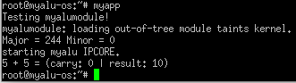

# MSE-IMD
Trabajo final de la asignatura "Implementación de manejadores de dispositivos" de la Maestría en Sistemas Embebidos de la Universidad de Buenos Aires.

## Introducción

Este trabajo implementa un flujo de trabajo que incluye:

* El diseño de un *register transfer level* de una unidad aritmética lógica.
* La verificación del diseño en hdl.
* El diseño de un "envoltorio" para implementar un esclavo *AXI Little*.
* La creación de un IPCore compatible con *Zynq-7000 SoC*
* La creación de un diagrama en bloques para conectar la Unidad de procesamiento de aplicaciones y el IPCore.
* Se exportó un archivo de descripción de hardware *XSA* con el *bitstream* embebido.
* Se generó un *Board Support Package* para facilitar la escritura de aplicaciones *baremetal*.
* Se creó una aplicación *baremetal* que validó la comunicación por el *Advance Microcontroller Bus Architecture (AMBA)*.
* Se generó un *kernel* de Linux para la plataforma implementada.
* Se implementó un módulo para manejar al eslavo AXI. Este aparece como *char device* y tiene incorporado comandos *ioctl*.
* Se generó una aplicación en C que carga el módulo, escribe y lee al esclavo.

## Instrucciones para replicar este proyecto

## Requerimientos
* Usted necesita una placa *Arty z7-20* de *Digilent*.
* Además, se necesita de Vivado, Vitis y Petalinux en su versión 2022.2.
* Finalmente, se necesita *GHDL* y *GTKWAVE*.

## Pasos a seguir

### Obtener la descripción del hardware

Este proyecto ya le entrega el archivo de descripción de hardware listo para usar.
Pero a continuación se detallan los pasos a seguir para lograr su propia implementación:

* Con estos requerimientos satisfechos, usted debe clonar el repositorio.
* En la carpeta **ipcore/rtl** encontrará un Makefile. Usted debe correrlo para verificar el diseño de la ALU.
* En la carpeta **ipcore/vivado/repositoy** usted tiene el IPCore empaquetado. Sin embargo usted es libre de realizar el empaquetado, tenga la precaución de llamar al esclavo **myalu**.
* Con el IPCore en su ambiente de Vivado, usted puede crear un diagramas en bloques que incluya el bloque **Zynq7000** y el esclavo **myalu**.
* Luego, debe crear un envoltorio hdl, generar los productos y finalmente crear el **bitstream**
* Con todo esto cumplido, puede exportar el **XSA** con el **bitstream** incrustado.

### Creación del proyecto petalinux

Este proyecto ya le entrega un proyecto petalinux listo para compilar, sin embargo se le recomienda lo siguiente:

* Descargar los archivos **sstate** y **downloads** de la página de Xilinx. Esto es para incrementar notablemente los tiempos de construcción de los proyectos petalinux.
* Utilice el comando `petalinux-config` para configurar un espejo local para **sstate** y **downloads**.
* Ejecute el comando `petalinux-build` para construir la imagen.
* Luego el comando `petalinux-package --boot --force --fsbl ./images/linux/zynq_fsbl.elf --fpga ./images/linux/system.bit --u-boot` para generar una imagen y secuencia de boteo que inicie la lógica programable con el **bitstream**
* Puede emular el sistema en QEMU con el comando `petalinux-boot --kernel --qemu`

Usted puede crear el proyecto petalinux desde cero, para eso se debe:

* Ejecutar el comando `petalinux-create --type project --template zynq --name nombre`
* Actualizar la descripción del hardware con `petalinux-config --get-hw-description <path al archivo (sin nombrar al archivo)>`
* Configure el *rootfs* y la secuencia de booteo a su gusto.
* Debe crear un módulo para el kernel con el comando `petalinux-create -t modules --name myalumodule --enable`
* Utilice los archivos que se encuentran en `petalinux/myalu-os/project-spec/meta-user/recipes-modules/myalumodule` para reemplazar los generados de manera automática.
* Debe crear una aplicación para probar el módulo con el comando `petalinux-create -t apps --template c --name myapp --enable`
* Utilice los archivos que se encuentran en `petalinux/myalu-os/project-spec/meta-user/recipes-apps/myapp` para reemplazar los generados de manera automática.

Finalmente usted puede lanzar el comando `petalinux-build`. No se preocupe si el proceso demora un tiempo considerable, además procure tener la suficiente memoria disponible en su disco rígido.

## Creación de tarjeta SD

Tome una tarjeta y genere dos particiones: una FAT32 y una EXT4.

En la partición FAT32 usted debe colocar los archivos: `boot.src`, `BOOT.BIN` y `image.ub`

En la partición EXT4 usted debe descomprimir el archivo `rootfs.tar.gz`

Estos archivos se encuentran en la carpeta `petalinux/myalu-os/images/linux`

## IPCORE

A continuación se especifican los parámetros más importantes del circuito sintetizado en la lógica programable.

### Lista de puertos

* clock_i: reloj del core.
* enable_i: habilita el funcionamiento del core.
* reset_n_i: reinicia el core cuando se aplica un nivel alto.
* carry_o: indica que la operación tuvo carry.
* ready_for_data_o: indica que el core se encuentra listo para operar.
* operation_i: selector de operación.
* operand1_i: primer operador.
* operand2_i: segundo operador.
* result_o: resultado de la operación.

### Datos del esclavo AXI

Dirección base: 0x43C00000

|Puerto           |Tipo|Registro|Bit |Offset|
|-----------------|----|--------|----|------|
|enable_i         |in  |R0      |0   |0     |
|reset_n_i        |in  |R0      |1   |0     |
|carry_o          |out |R1      |0   |4     |
|ready_for_data_o |out |R1      |1   |4     |
|operation_i      |in  |R2      |31:0|8     |
|operand1_i       |in  |R3      |31:0|12    |
|operand2_i       |in  |R4      |31:0|16    |
|result_o         |out |R5      |31:0|20    |

### Prueba del diseño de placa

Se realizó un programa en Vitis para verificar el funcionamiento del ipcore y su conexión con la unidad de procesamiento de aplicaciones.

### Prueba en Petalinux

Se realizó una prueba simple con `devmem` y se verificó que **5+5=10**.

## Petalinux

Se realizó un módulo llamado `myalumodule` que crea un *char device*.

Se puede escribir al dispositivo `operacion,operando1,operando2`.

Se puede leer el dispositivo `carry,resultado`.

Finalmente se ejecutó el programa de prueba `myapp` que hace uso del driver.

